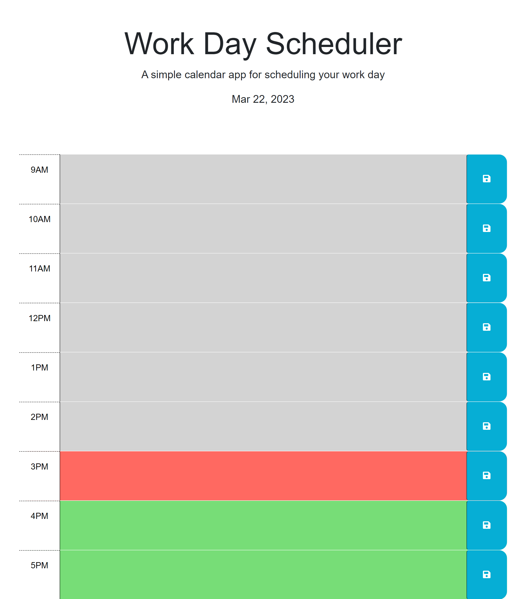

# Work Day Scheduler

## Description

Work Day Scheduler is a simple and efficient web application that helps you manage your daily tasks during your 9-to-5 work hours. With a clean interface and local storage functionality, this application allows you to input text into each time slot, save your schedule, and automatically updates the background colors of time slots based on whether they are in the past, present, or future based on the current time of day.

https://mattlombard.github.io/Work-Day-Scheduler/

## Usage

One of the key features of Work Day Scheduler is its ability to automatically update the background colors of time slots based on whether they are in the past, present, or future. This not only provides a clear visual indication of your progress throughout the day but also helps you stay organized and focused on upcoming tasks. The responsive design of the application ensures a seamless experience, making it an excellent tool for busy professionals who need a straightforward way to plan and track their daily activities.

## Credits

Collaborators: Chris Snyder, Humberto Flores, Tyrrance Miller
